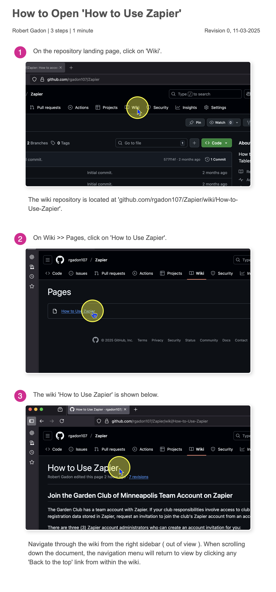

## About Zapier
    - Zapier is a software-as-a-service platform that manages data for procesing, storage, and output. 
    - It is used by the Garden Club of Minneapolis to process form submissions sent from the club website. 
    - As of the current revision to this README.md, Zapier is used to process memberships and club event registrations. 

## About this wiki
    - Wiki is a Hawaiian term that means quick or brief. 
    - Wikis serve to provide information about software programs to visitors and users.
    - This wiki describes how to: 
        - access the club's Zapier team account,
        - navigate to find various Zapier tables and workflows ( Zaps ),
        - find and open a Zapier Table, 
        - filter Zapier Table data,
        - save filtered data as a custom view,
        - perform common tasks within Zapier Tables such as create(add), read(view), update(modify), or delete records (CRUD),
        - download Zapier Table data to your local computer, and
        - manage non-renewing membership data in Zapier Tables (copy / paste, and delete records).

## How to open the wiki
    - Follow the steps shown below to open the wiki on this site. 

## Why the project is useful
    - Zapier provides data processing and storage of club records within a team-based account.
    - Data is stored independent of individual accounts and personal computer operating systems.
    - This wiki provides documentation on how to access the club's Zapier account and use Zapier Tables.

## For questions or comments about this project
    - If content in the README or wiki is no longer applicable or outdated, please contact an administrator of the club's Zapier account.
    - Contact Robert Gadon at rgadon107 at gmail dot com.

Version 1.1, 04-12-2026
