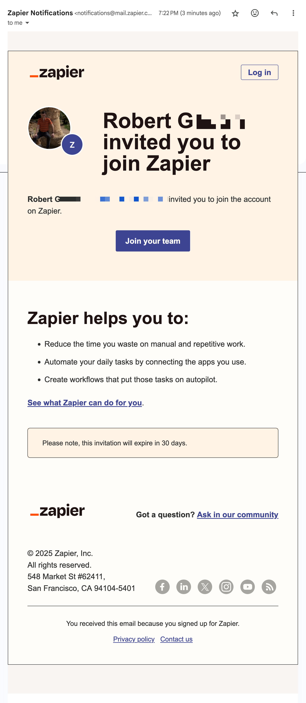
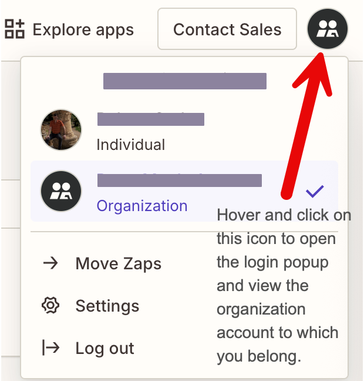
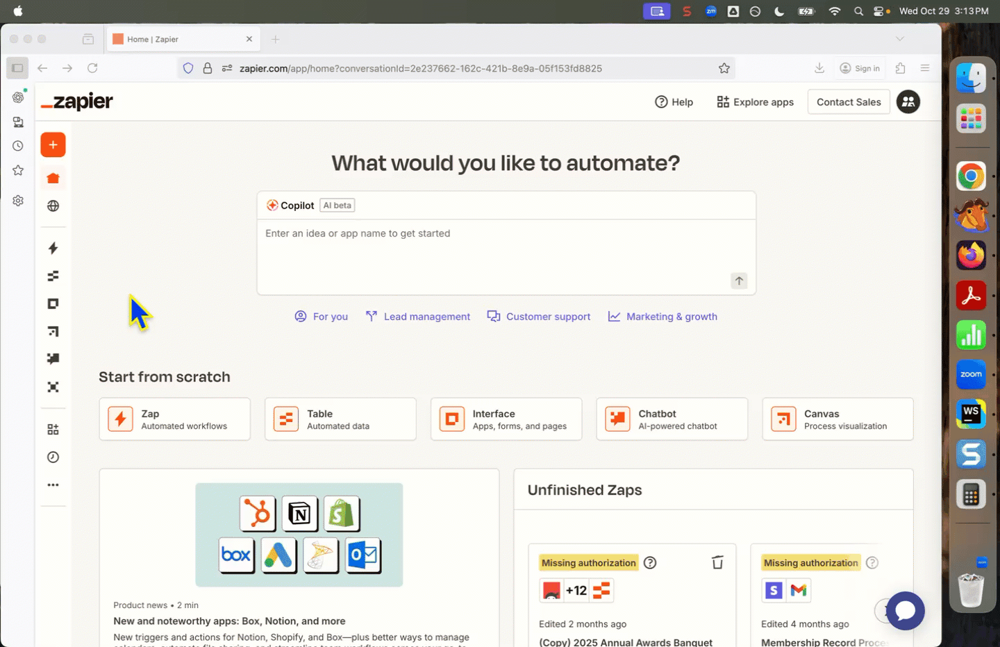

## Join the Garden Club of Minneapolis' team account on Zapier

The Garden Club has a team account with Zapier.  If your club responsibilities involve access to club membership or event registration data stored in Zapier, request an invitation to join the club's Zapier account from an account administrator.

There are 3 Zapier account administrators who can create an account invitation for you:
- Robert Gadon,
- Kristine Knowles, or
- Peter Moe (account owner).

The email invitation will originate from Zapier at <notifications@mail.zapier.com>.  Below is an example of a Zapier notification email inviting you to join the club's team account.

If you requested team member access to Zapier from a team administrator, accept the invitation to join.

## Create a personal Zapier account to access the club's team account

[Create a Zapier account using the email address you provided for your account invitation.](https://zapier.com/)  Zapier will connect you to the club's team account.

After you log in, scroll your cursor over the black and white icon in the upper right corner of your screen.

On hover, a popup will open that identifies you as an individual account holder and a member of the club's organization account.

## Open the Zapier Tables landing page from the Zapier navigation menu

Once you are logged in to the club's Zapier account, move your curser to the left side of the screen to open the navigation panel.

Move the cursor over the left sidebar and expose the navigation menu. Select the Tables nav item to open the Tables landing page.

## Zapier Tables

### The Zapier Tables landing page

The Zapier Tables landing page will display all the tables that you are permitted to view by the site administrator. If you don't see a Zapier Table listed on the Tables landing page, ask the administrator to change your permission access.

Team members are assigned one of 2 table permissions; *viewer* or *editor*. A *viewer* can view (read) the table but cannot edit it. An *editor* can both view and edit a table.

### Change the display order of Zapier Tables on the landing page

By default, Zapier Tables names are ordered by numbers (0 -9) followed by letters (A-Z). Table file names that begin with a number (e.g. 2025) appear at the top of the landing page before file names that begin with a letter. 

Sort and find the tables that you plan to open by changing the order of Zapier Table names displayed on the landing page.

Move your cursor over the 'Name' label at the top of the Tables page and click the label. The directional arrow will change (up / down) on each click. The order of table names will also change based on the direction of the arrow. 

### Open a Zapier Table

Move your cursor over the name of a Zapier Table and click the table name to open it. The table will open in the same browser tab as the Tables landing page. 

### Navigate from an open Zapier Table back to the Tables landing page

1) To return to the *Tables landing page* from within an open table, click the 'Tables' label in the upper left corner of the browser window. 

2) To return to the *Zapier home page*, move your cursor over the house icon in the top left corner of the browser and click. 

### Navigate Between Multiple Zapier Tables Open at the Same Time

To access 2 or more Zapier Tables _at the same time_, open each table in a separate browser tab. Select the table you want to view by navigating between tabs.  

In the example above, 4 tabs are shown side-by-side. From left to right, they include the Zapier Tables landing page (main table navigation) and 3 membership tables. 

### Table and Record views within a Zapier Table

#### The table view is the default view.

- When a Zapier Table is open, table rows are shown by default. Each row represents a single member record. 
- The contents of each table row can also be viewed as a vertical popup on the right side of the screen.

#### Multiple Team Members Can View a Zapier Table at the Same Time

When two or more team members have administrative access to the same Zapier Table, it's possible for those team members to view that table at the same time. 

The image below shows that another team member is viewing the same Zapier Table open on your desktop. The letter 'P' surrounded by a red circle at the top of the Zapier Table means that a team member who's name begins with that letter has the same table open on their desktop as you. 

The image below shows that this same team member (with initials PK) has the table row (record) for row number 1 open on their desktop. 

When another team member opens the same Zapier Table as you, it's possible that the table contents could change while you are viewing it. Refresh your browser to confirm that any changes were made. 

### How to view a single record as a popup.

### Find a value within a Zapier Table 

Use the built-in search field within a Zapier Table to search for any value within a field.

#### Keyboard shortcut to open the 'search' field

The alternative to clicking on the search field inside a Zapier table is to _open it from the keyboard_. 

- (Mac) Press the 'Command' and letter 'F' key at the same time. 
- (Windows) Press the 'Control' and letter 'F' key at the same time.

Either keyboard command will open the search field in the upper right corner of the table. Try it yourself. Then add a term to search in the search field.

### Add a new row to a Zapier Table 

To add a new row to a Zapier Table, press the 'Add record' button in the bottom-left corner of the table. A new, empty table row will automatically be added to the bottom of the existing table.

### Edit a new or existing row within a Zapier Table

- Each field within a table row can be edited from the table view.
- Alternatively, a table row can be edited within a record popup. 
- See above: **How to View a Single Record as a Popup** on how to add, edit, or delete content within a field.

### Show / Hide columns within a Zapier Table

Table columns and their fields can be hidden or shown by the checkboxes selected in the 'Hidden Fields' popup. This allows one to create a custom view of one or more table records. 

#### Locate the 'Hidden Fields' menu icons in a Zapier Table

There are 2 'Hidden Field' icons visible from the table view; they are located on the left sidebar and the top left table menu. 

#### Open and Close the 'Hidden Fields' popup menu

The hidden fields popup menu can be toggled open or closed by clicking on an icon (left sidebar) or label (top left corner of screen).

#### Create a Custom View of a Zapier Table Within the Hidden Fields Popup Menu {#Create-Custom-View}

The following example shows how to turn off multiple table columns to create a custom table view. Thirteen (13) of the table's 16 columns are hidden, leaving visible only the columns for Last Name, First Name, and Email. This custom view applies only to the current table. 

### Save a Custom Table View by Name

If you regularly use a custom table view, you can save the view configuration by name. Using the previous example, the following video shows how to save a custom table view named 'My Custom View'. 

When working again in this Zapier Table, you can quickly find and toggle between your saved custom view and the default table view (see below).

[For more information on custom views, refer to the Zapier documentation page **'Create views in Zapier Tables'** .](https://help.zapier.com/hc/en-us/articles/19097922477453-Create-views-in-Zapier-Tables#h_01H97S16MMDPSTTA4KPPV599Q6)

### Sort Table columns alphabetically

Table columns that contain numbers or text can be sorted in ascending or descending order.

**Ascending numbers** increase from low to high (0 -> 9) while **descending numbers** decrease from high to low (9 -> 0).  **Ascending text** increases from A to Z, while **descending text** decreases from Z to A.

The following GIF demonstrates how to alphabetically sort a column of names in ascending followed by descending order, and then turning off the sort. 

- When the table is sorted by a column, the direction of the sort ( ascending / descending ) will be marked by an arrow at the top of the column. 
- Look to the right of the column label for the arrow. 
- A sorted column can be cancelled by selecting 'Clear Sort' in the open dialogue box.
- An unsorted column does not show a directional arrow at the top of the column.

### Filter Columns Within a Zapier Table

There are 2 'Filter' icons visible from the table view. A 'Filter' menu label is located in the top-left table menu, while a filter icon is located on the table's left sidebar (see below). Click on either the icon or menu label to open the filter menu popup.

- The filter popup allows users to filter on one or more columns in the table. 
- The filter popup menu allows for 1 **or more** filter items to be set at the same time.
- As additional filter items are set, the filter becomes increasingly refined.
- If a filter returns no records ( table rows ), try the following:
  - modify the filter to be less restrictive, or 
  - change the conditions of the filter, or 
  - filter on a different column.

- **NOTE:** Filter settings only apply **to the current table view**. If you refresh your browser, the filter _will not persist_. You will have to reset it again. Likewise, if you open a different Zapier Table, the filter set in the first table will not persist and display in the new table. 

### Save a Filter by Name / Save a Custom View

Like hidden fields, filters can also be saved by name. The following steps show how to name and save a filter for later use. 

The value of _saving a filter by name_ is that once saved, it can be reopened in one of two ways: 
1. **From within the Zapier Table:** Find the 'Main Table' down-down menu located in the top-left corner of the table. Hover your cursor over the label and click to open it. Select any saved view file from within the drop-down menu. 
2. **From the Zapier Tables landing page:** The names of saved filters are also listed on the 'Tables' landing page along with the names of the Zapier Tables available for view. 

### Count Table Rows ( Records )

There are 2 ways to count the number of table rows (records) in a Zapier Table.

1. Look at the bottom margin of a Zapier Table. The number of table rows visible in the current table view will be displayed.
   - IMPORTANT! For an accurate **total count** of all table rows in a table, unset _all table filters_. 

2. Scroll down to the bottom of a table. Look along the left margin at the last table row number.

The following image shows where to look at the bottom of a table for both items 1 and 2 above. 

### Sum a count in a Table column

Any column with a Number field type ( the column accepts whole or decimal numbers ) can sum the value of that column ( see below ).

This is a useful feature in Zapier Tables that store event registration data such as the public garden tour, the awards banquet, and dinner reservations for monthly meetings.

### View ( read ) data from a Zapier Table

#### There are 4 ways to view (read) data from a Zapier Table.
1. **Table view from within Zapier Tables:** read the table data from left to right. 
2. **Select an individual table row (record) and view it as a popup.**
3. **A custom table view from within Zapier Tables:** select table columns to hide and display only the columns you wish to see.
  - [see 'Create a Custom View of a Zapier Table Within the Hidden Fields Popup Menu' above](#Create-Custom-View)

4. **As a download to your computer:** download the entire table or a custom table view to your computer. 

#### From Google Drive

The Membership Committee maintains a Google Drive at the account address 'membershipgcm@gmail.com'. The 'Membership Record Processing' Zap (data processing workflow) sends the names of each renewing and new member to a spreadsheet located at 'GCM Current Membership List' >> 'GCM Current Membership List'.

### Delete a row within a Zapier Table

